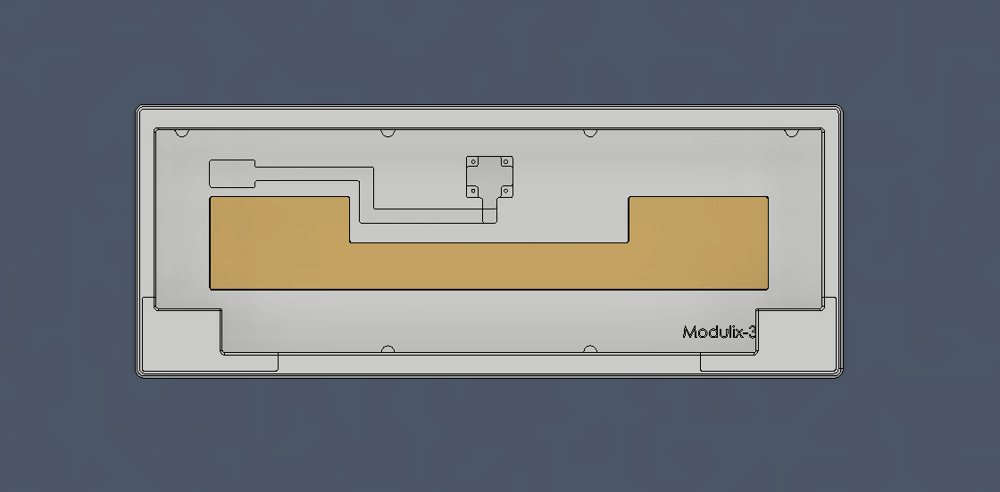
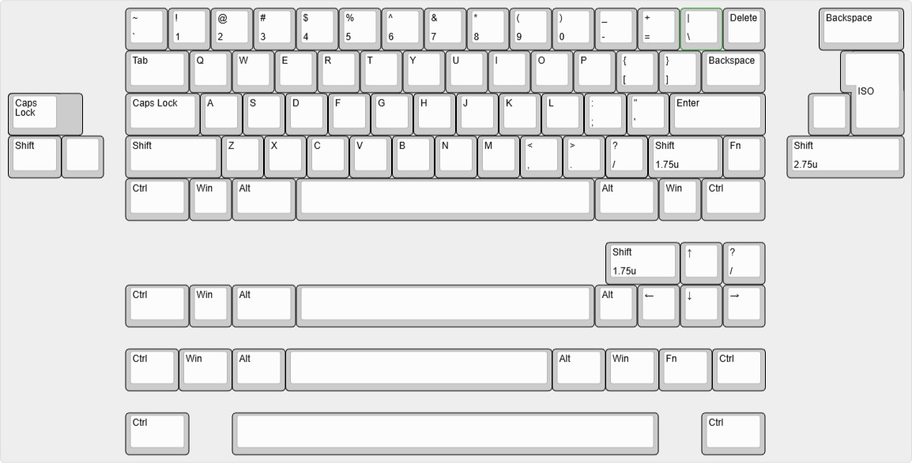

# Modulix-3d
A 3d-printed, modular, 60% mechanical keyboard case
Designed by ht2660

Features:
1. Compatible with standard 60% PCBs (including the Venom 60HE)
2. Incorporates [Plain60-flex](https://github.com/evyd13/plain60-flex-edition.git) mounting positions 
3. Supports multiple mounting styles (top mount, gasket mount, O-ring gasket mount)
4. Supports multiple layouts (including HHKB, WKL, WK, ISO, and 10u spacebar) 
5. Suitable for 3D printing (not suitable for CNC machining)
6. 18mm front height
7. 7-degree typing angle
8. Includes a weight
9. Supports 8mm diameter feet
10. Daughterboard installed upside down (Unified Daughterboard by ai03)
11. Incorporates heat sink brass insert

Screws:
1. Top mount screws (8x): M3x5 pan head
2. Case screws (6x): M3x10 socket head
3. Daughterboard screws (4x): M2x5 tapping
4. Weight screws (3x): M3x5 countersink head
Notice:
This design has not been tested; use it at your own risk. This project is created mainly for DIYers and hobbyists who are interested in mechanical keyboards and have a tight budget.
Modulix-3D is designed around the concepts of 3D-printing compatibility, minimalism, cheap and easily sourced components, modularity, and flexibility—all combined into a 60% keyboard.
Though not required, if you end up creating a new project based on this file, please let me know! I might be able to support you.

Modulix-3D
Bàn phím cơ 60%
Thiết kế bởi ht2660

Tính năng:
1. Tương thích với các mạch (PCB) 60% tiêu chuẩn (bao gồm cả Venom 60HE)
2. Tích hợp các vị trí ngàm của Plain60-flex
3. Hỗ trợ nhiều kiểu mounting (top mount, gasket mount, O-ring gasket mount)
4. Hỗ trợ nhiều layout (bao gồm HHKB, WKL, WK, ISO và space 10u)
5. Phù hợp cho in 3D (không phù hợp để gia công CNC)
6. Chiều cao mặt trước 18mm
7. Góc gõ 7 độ
8. Có tạ đáy 
9. Hỗ trợ feet đường kính 8mm
10. Daughterboard được lắp úp ngược (Sử dụng mạch Unified Daughterboard của ai03)
11. Hỗ trợ ốc ren cấy

Ốc vít:
1. Ốc top mount (8 con): Đầu dù M3x5
2. Ốc case (6 con): Đầu trụ M3x10
3. Ốc mạch daughterboard (4 con): Vít M2x5
4. Ốc tạ (3con): Đầu chìm M3x5

Lưu ý:
Thiết kế này chưa được thử nghiệm thực tế; bạn tự chịu rủi ro khi sử dụng vì mục đích cá nhân. Dự án này được tạo ra chủ yếu dành cho những người thích (DIY) và người chơi hệ phím cơ có ngân sách eo hẹp.
Modulix-3D được thiết kế xoay quanh các tiêu chí: phù hợp với việc in 3D, tối giản, sử dụng linh kiện giá rẻ và dễ tìm, tính mô-đun và sự linh hoạt — tất cả được kết hợp gọn gàng trong một chiếc bàn phím cơ 60%.

Mặc dù không bắt buộc, nhưng nếu bạn tạo ra một dự án mới dựa trên thiết kế này, vui lòng hãy cho mình biết nhé! Mình có thể hỗ trợ bạn.

